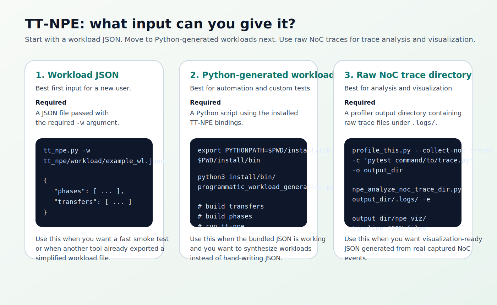
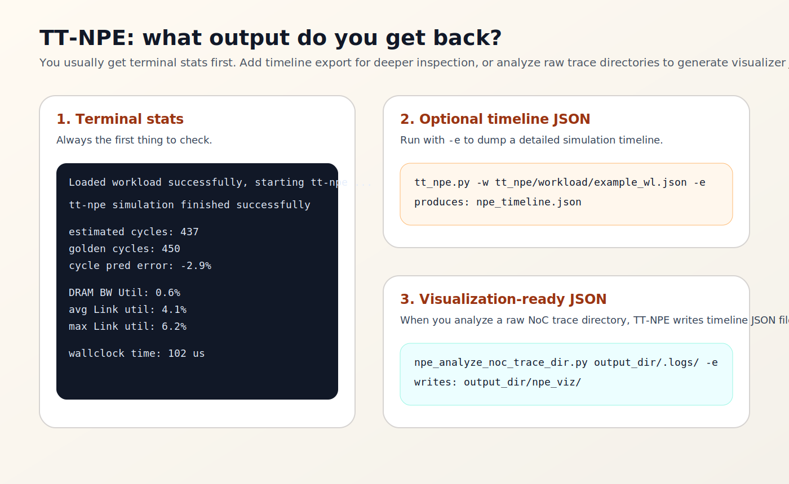

# TT-NPE Installation Manual

**Tool:** TT-NPE (Tenstorrent Network-on-Chip Performance Estimator)  
**Primary upstream repo:** `https://github.com/tenstorrent/tt-npe`  
**Validated tester output date:** 2026-04-06  
**Validated tester commit:** `09d56e9bd91408d449042315d61f91a59c6cbbca`

This manual covers installation and first-run verification only.

---

## 1. What You Install

The upstream quick start is short:

1. clone `tt-npe`;
2. run `./build-npe.sh`;
3. optionally `source ENV_SETUP`;
4. run `tt_npe.py` with a workload file.

After a successful build, the important install outputs are:

- `install/bin/tt_npe.py`
- `install/bin/programmatic_workload_generation.py`
- `install/lib/libtt_npe.so`
- Python extension files under `install/lib/`

---

## 2. Host Requirements

The validated Linux tester run had these tools available:

```bash
git
cmake
ninja
clang-17
python3
```

You also need network access for the initial clone and build-time dependency downloads.

---

## 3. Clone And Build

HTTPS:

```bash
git clone https://github.com/tenstorrent/tt-npe.git
cd tt-npe
./build-npe.sh
```

SSH:

```bash
git clone git@github.com:tenstorrent/tt-npe.git
cd tt-npe
./build-npe.sh
```

If the build succeeds, the install tree is ready.

---

## 4. Optional Shell Setup

```bash
source ENV_SETUP
```

On the validated tester host, `ENV_SETUP` selected the correct Python binary and only showed a warning for optional package installation.


If you prefer not to depend on shell setup, you can run the installed script directly with Python.

---

## 5. Required Input For The First Run

For the first verification run, the required input is a workload JSON file passed with `-w`.



The simplest beginner input is the bundled example:

```bash
tt_npe.py -w tt_npe/workload/example_wl.json
```

Direct invocation also works:

```bash
python3 install/bin/tt_npe.py -w tt_npe/workload/example_wl.json
```

---

## 6. What Output You Should Expect

The first visible output is terminal stats:

- successful workload load;
- successful simulation completion;
- estimated cycles;
- bandwidth and link utilization numbers.


You can also request a detailed timeline JSON dump:

```bash
tt_npe.py -w tt_npe/workload/example_wl.json -e
```

That writes `npe_timeline.json` by default.



---

## 7. Clean Install Verification

Use this exact sequence:

```bash
git clone https://github.com/tenstorrent/tt-npe.git
cd tt-npe
./build-npe.sh
source ENV_SETUP
tt_npe.py -w tt_npe/workload/example_wl.json
```

If the last command finishes successfully and prints stats, the installation is complete.

---

## 8. Common Problems

### `build-npe.sh` fails

Re-check:

- compiler availability;
- Python availability;
- network access for dependency fetches.

### `ENV_SETUP` warns

Try the direct command:

```bash
python3 install/bin/tt_npe.py -w tt_npe/workload/example_wl.json
```

### You want deeper output than terminal stats

Use:

```bash
tt_npe.py -w tt_npe/workload/example_wl.json -e
```

That gives you the timeline JSON needed for deeper inspection.
