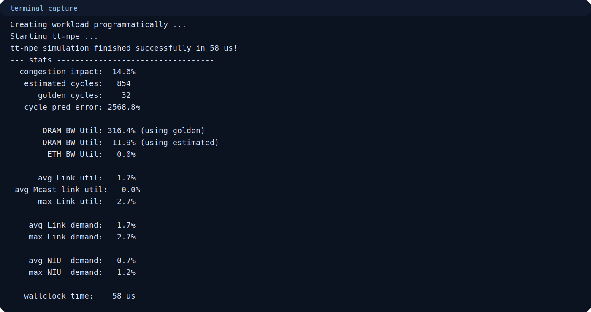
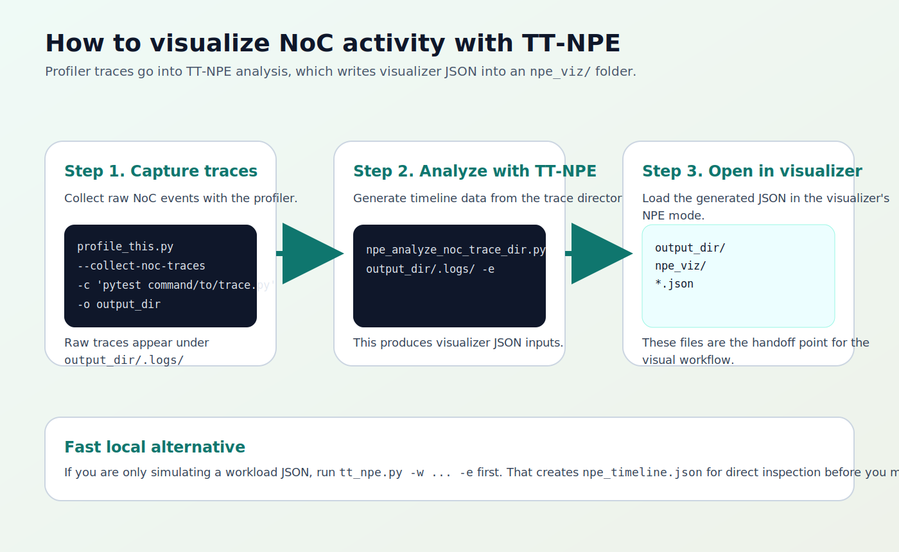

# TT-NPE Practical Example Manual

**Tool:** TT-NPE (Tenstorrent Network-on-Chip Performance Estimator)  
**Primary upstream repo:** `https://github.com/tenstorrent/tt-npe`  
**Validated tester output date:** 2026-04-06  
**Validated tester commit:** `09d56e9bd91408d449042315d61f91a59c6cbbca`

This manual focuses on practical use:

- what input `tt-npe` accepts;
- what output it produces;
- how to generate files you can visualize.

---

## 1. Input Types

`tt-npe` is easiest to understand if you group inputs into three paths:

1. workload JSON;
2. Python-generated workload;
3. raw NoC trace directory.


### 1.1 Workload JSON

This is the best first input.

```bash
tt_npe.py -w path/to/workload.json
```

The `-w` argument is required for this mode.

### 1.2 Python-generated workload

This is useful when you want to script the workload instead of storing it as hand-written JSON.

```bash
export PYTHONPATH=$PWD/install/lib:$PWD/install/bin
python3 install/bin/programmatic_workload_generation.py
```

### 1.3 Raw NoC trace directory

This is the path you use when you want analysis and visualization from captured NoC traces.

```bash
npe_analyze_noc_trace_dir.py output_dir/.logs/ -e
```

---

## 1.4 Raw NoC Trace Format Notes

The upstream `noc_trace_format.md` document matters for one reason: it describes the **raw trace JSON family** that `tt-npe` consumes when you are working from captured device traces instead of synthetic workload JSON.

The practical rules are:

- raw NoC trace JSON is produced by trace capture tooling and stored under a profiler output directory such as `output_dir/.logs/`;
- these raw trace files are **not** the same thing as the visualization JSON generated later by `tt-npe`;
- `tt-npe` reads the raw trace directory, interprets the captured NoC events, and can then emit higher-level timeline data with `-e`;
- for direct simulation with `tt_npe.py`, you normally start with a workload JSON passed through `-w`, not a raw `.logs/` directory.

That distinction is the main thing to keep straight:

1. raw trace JSON in `.logs/`
2. analyzed NPE timeline JSON in `npe_viz/`
3. visualizer reads the NPE-oriented output, not the raw trace capture files directly

---

## 2. Output Types

There are three outputs to care about:

1. terminal stats;
2. `npe_timeline.json`;
3. visualization JSON under `output_dir/npe_viz/`.


### 2.1 Terminal stats

This is the default output and the first thing to check.

Typical values include:

- estimated cycles;
- golden cycles;
- cycle prediction error;
- DRAM bandwidth utilization;
- link utilization;
- wallclock simulation time.

### 2.2 `npe_timeline.json`

Add `-e` when simulating a workload JSON:

```bash
tt_npe.py -w tt_npe/workload/example_wl.json -e
```

This writes `npe_timeline.json` by default.

### 2.3 `output_dir/npe_viz/`

When you analyze a trace directory with:

```bash
npe_analyze_noc_trace_dir.py output_dir/.logs/ -e
```

TT-NPE writes timeline JSON files under `output_dir/npe_viz/`.

These files are different from:

- the raw NoC trace JSON under `.logs/`;
- the standalone `npe_timeline.json` file produced by `tt_npe.py -e`.

---

## 3. Example 1: Run The Bundled Workload

```bash
tt_npe.py -w tt_npe/workload/example_wl.json
```

If you do not want to use `ENV_SETUP`:

```bash
python3 install/bin/tt_npe.py -w tt_npe/workload/example_wl.json
```

What success looks like:

- workload loads successfully;
- simulation finishes successfully;
- stats are printed.


---

## 4. Example 2: Run The Programmatic Python Example

```bash
export PYTHONPATH=$PWD/install/lib:$PWD/install/bin
python3 install/bin/programmatic_workload_generation.py
```

What success looks like:

- workload creation message;
- simulation start message;
- stats block after completion.



This is the right next step after the bundled JSON example.

---

## 5. Example 3: Generate A Timeline File

If you want more than terminal stats, add `-e`:

```bash
tt_npe.py -w tt_npe/workload/example_wl.json -e
```

This creates:

- terminal stats in the shell;
- `npe_timeline.json` in the current working directory.

That JSON contains detailed simulation timeline data and is the cleanest first artifact for deeper inspection.

---

## 6. How To Visualize NoC Activity

There are two clean paths.

### 6.1 Fast local inspection path

```bash
tt_npe.py -w tt_npe/workload/example_wl.json -e
```

Inspect the generated `npe_timeline.json` directly to verify that the simulation produced per-timestep timeline data.

### 6.2 Visualizer path from raw NoC traces

If you already have a profiler output directory with raw NoC traces under `.logs/`, run:

```bash
npe_analyze_noc_trace_dir.py output_dir/.logs/ -e
```

This produces visualization-ready JSON under:

```text
output_dir/npe_viz/
```

Those files are the handoff files for the visualizer.



### 6.3 What `ttnn-visualizer` can display

Yes, `ttnn-visualizer` can display TT-NPE output, but the supported path is the **NPE-ready data** generated for it.

Use this mental model:

- raw `.logs/` NoC traces are capture artifacts;
- `npe_analyze_noc_trace_dir.py output_dir/.logs/ -e` converts those traces into NPE visualization data;
- `ttnn-visualizer` reads NPE data on its `/npe` route or from a profiler/performance report folder that contains the generated `npe_viz` subdirectory.

So the clean answer is:

- `ttnn-visualizer` **does support TT-NPE outputs** for NPE visualization;
- the most clearly supported visualizer input is the generated `npe_viz` data;
- do not treat raw `.logs/` files as if they were already visualizer-ready.

---

## 7. Clean Learning Path

Use this order:

1. run the bundled JSON workload;
2. run the Python-generated workload;
3. export `npe_timeline.json` with `-e`;
4. move to raw trace analysis with `npe_analyze_noc_trace_dir.py` when you need visualizer-ready JSON.

That path keeps the workflow simple and makes each output easy to understand.
