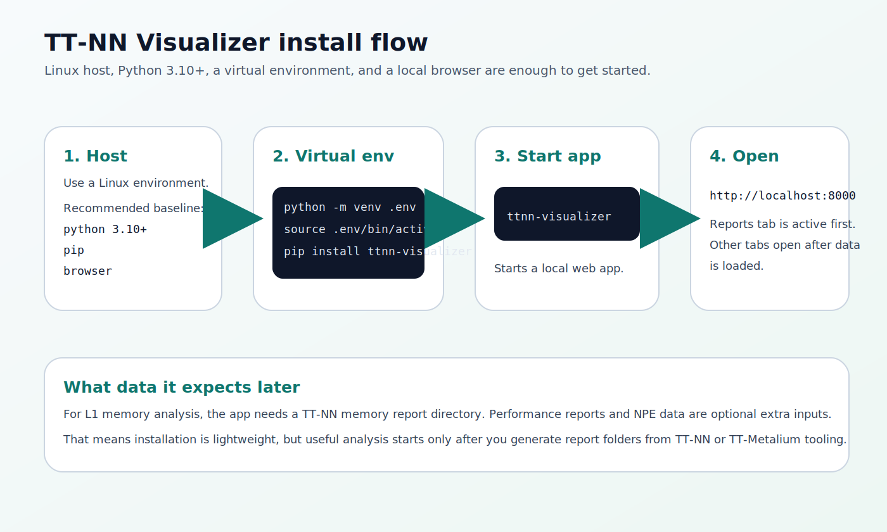
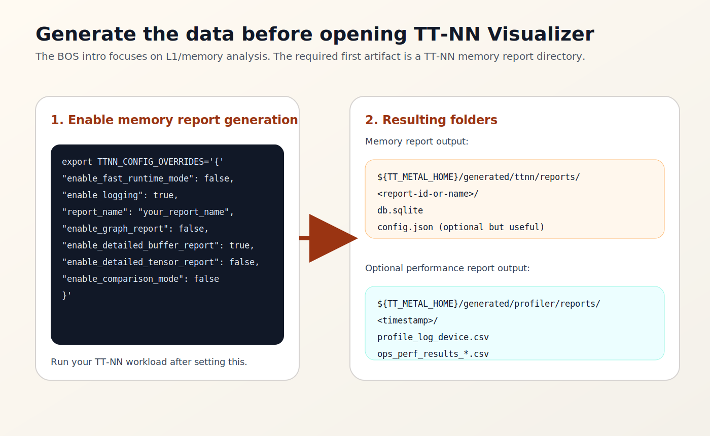
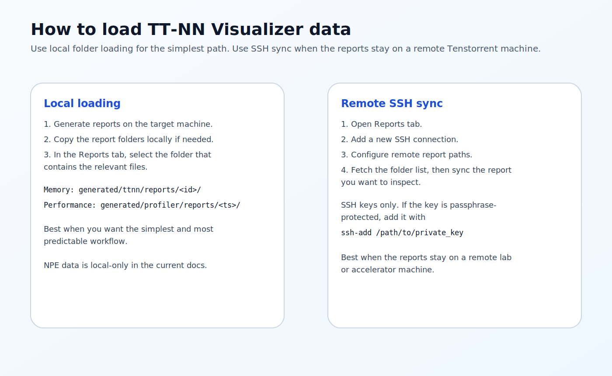

# TT-NN Visualizer Installation Manual

**Tool:** TT-NN Visualizer  
**Primary upstream repo:** `https://github.com/tenstorrent/ttnn-visualizer`  
**BOS source used:** `C:\bos\bos-sdk\docs\04_SDK Contents\11_Tools\L1_buffer_visualizer_intro.md`

This manual covers installation and setup.

It is written from two sources:

- the BOS Eagle-N L1 buffer visualizer intro, which is focused on the practical L1-memory workflow;
- the upstream `ttnn-visualizer` project, which defines the current install path and feature set.

---

## 1. What TT-NN Visualizer Is For

TT-NN Visualizer is the Tenstorrent browser-based analysis tool for:

- operation-level model inspection;
- L1 and DRAM memory plots;
- tensor and buffer details;
- graph and operation-flow views;
- local report loading and remote SSH sync.

The BOS intro uses it mainly as an **L1 Buffer Visualizer**, which is a good way to think about the beginner workflow.

---

## 2. Prerequisites

You need:

- a Linux environment;
- Python 3.10 or newer;
- `pip`;
- a browser on the same machine.

Using a virtual environment is strongly recommended.



---

## 3. Install The Tool

Create and activate a virtual environment:

```bash
python3 -m venv .env
source .env/bin/activate
```

Install from PyPI:

```bash
pip install ttnn-visualizer
```

Start the app:

```bash
ttnn-visualizer
```

Then open:

```text
http://localhost:8000
```

The first screen is the `Reports` tab. Other tabs become useful after report data is loaded.

---

## 4. Optional SSH Preparation

If you want to sync reports directly from a remote machine, prepare SSH first.

Simple agent setup:

```bash
eval "$(ssh-agent -s)"
ssh-add ~/.ssh/id_rsa
```

You only need this if:

- your reports remain on a remote host;
- you plan to use the visualizer's SSH sync feature.

---

## 5. What Data You Need Before The Visualizer Becomes Useful

Installing the app is easy. The important setup step is generating report folders that the app can open.

For the BOS-style L1 workflow, the first required artifact is a **TT-NN memory report**.



The BOS intro uses this environment variable set before running the model:

```bash
export TTNN_CONFIG_OVERRIDES='{
  "enable_fast_runtime_mode": false,
  "enable_logging": true,
  "enable_graph_report": false,
  "report_name": "my_visualizer_run",
  "enable_detailed_buffer_report": true,
  "enable_detailed_tensor_report": false,
  "enable_comparison_mode": false
}'
```

Then run your TT-NN model or test.

This creates a memory report directory under:

```text
${TT_METAL_HOME}/generated/ttnn/reports/
```

If you omit `report_name`, the report workflow is much less useful because the run is not dumped with a stable named report.

---

## 6. Local Loading

This is the cleanest starting point.

1. Generate the memory report on the target machine.
2. Keep it local or copy it locally.
3. Open `ttnn-visualizer`.
4. Use the `Reports` tab to select the generated report folder.

For memory-focused analysis, the path usually comes from:

```text
generated/ttnn/reports/<report-id-or-name>/
```

---

## 7. Remote Loading Over SSH

The BOS intro also describes the remote workflow.

High-level flow:

1. Open the `Reports` tab.
2. Add a new remote connection.
3. Enter host, user, and remote report paths.
4. Fetch the remote folder list.
5. Sync the specific report you want.
6. Open the synced report locally inside the visualizer.



Use this when the report folders stay on a lab machine or accelerator server.

---

## 8. Installation Verification Checklist

You can consider installation complete when all of these work:

1. `pip install ttnn-visualizer` finishes successfully.
2. `ttnn-visualizer` launches without crashing.
3. `http://localhost:8000` opens in your browser.
4. You can load at least one TT-NN report folder from `generated/ttnn/reports/`.

---

## 9. Minimal Successful Setup

```bash
python3 -m venv .env
source .env/bin/activate
pip install ttnn-visualizer
ttnn-visualizer
```

Then generate a TT-NN memory report and load it from the `Reports` tab.
