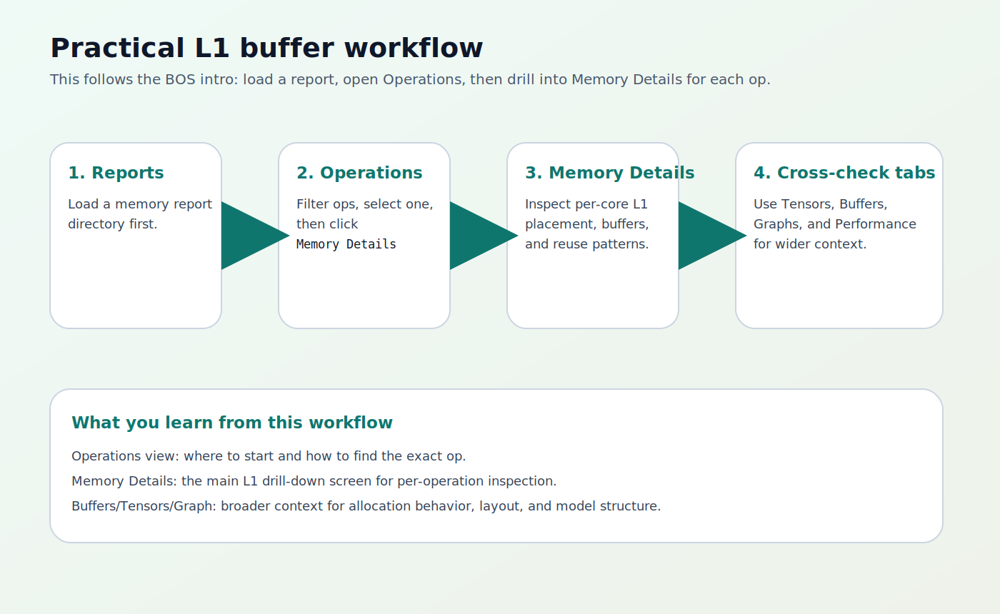

# TT-NN Visualizer Practical Example

**Tool:** TT-NN Visualizer  
**Primary upstream repo:** `https://github.com/tenstorrent/ttnn-visualizer`  
**BOS source used:** `C:\bos\bos-sdk\docs\04_SDK Contents\11_Tools\L1_buffer_visualizer_intro.md`

This manual shows the practical L1-buffer workflow.

The goal is simple:

1. generate a TT-NN memory report;
2. load it in TT-NN Visualizer;
3. inspect L1 usage for a specific operation.

---

## 1. Practical Goal

The BOS intro uses TT-NN Visualizer as an L1 memory inspection tool.

That means the most useful first example is not "open every tab." It is:

1. create one report from a model run;
2. load that report;
3. open `Operations`;
4. drill into `Memory Details`.

---

## 2. Generate A Memory Report

Before running your model, set:

```bash
export TTNN_CONFIG_OVERRIDES='{
  "enable_fast_runtime_mode": false,
  "enable_logging": true,
  "enable_graph_report": false,
  "report_name": "l1_visualizer_demo",
  "enable_detailed_buffer_report": true,
  "enable_detailed_tensor_report": false,
  "enable_comparison_mode": false
}'
```

Then run your TT-NN model or pytest case.

This creates a report directory under:

```text
${TT_METAL_HOME}/generated/ttnn/reports/
```


---

## 3. Start TT-NN Visualizer

Activate the same virtual environment you used for installation if needed:

```bash
source .env/bin/activate
```

Start the app:

```bash
ttnn-visualizer
```

Open:

```text
http://localhost:8000
```

At startup, the `Reports` tab is the main entry point.

---

## 4. Load The Report

### Option A: Local folder

This is the easiest path.

1. Open the `Reports` tab.
2. Choose the local report folder under `generated/ttnn/reports/...`.
3. Wait for the report to load.

### Option B: Remote SSH sync

Use this if the report remains on a remote machine.

1. Open the `Reports` tab.
2. Add a new SSH connection.
3. Fill in host, user, and report path information.
4. Fetch the remote folder list.
5. Sync the desired report.
6. Open the synced copy.


---

## 5. Inspect L1 Memory For One Operation

Once the report is loaded:

1. open `Operations`;
2. select one operation from the list;
3. click `Memory Details`;
4. inspect the L1 memory layout for that operation.

This is the core BOS workflow.



The `Memory Details` view is the main screen for:

- per-core L1 allocations;
- buffer placement and reuse;
- how one operation consumes memory on the device.

---

## 6. Use The Other Tabs To Add Context

After checking `Memory Details`, move sideways through the app:

- `Tensors` to inspect tensor shape, layout, and placement;
- `Buffers` to see allocation behavior more globally;
- `Graph` to understand model structure and data flow;
- `Performance` if you also loaded a profiler/performance report.

This is usually the best pattern:

1. find the suspicious op in `Operations`;
2. inspect it in `Memory Details`;
3. cross-check the same run in `Buffers` and `Tensors`.

---

## 7. Optional Performance Pairing

TT-NN Visualizer can also open performance-oriented report data.

That is useful when you want to connect:

- memory pressure;
- operation structure;
- execution timing.

For a first L1 example, keep memory reporting as the required path and treat performance data as optional.

---

## 8. What A Good First Session Looks Like

A successful beginner session is:

1. a named TT-NN report is generated;
2. TT-NN Visualizer opens it from the `Reports` tab;
3. you can select an operation;
4. `Memory Details` opens and shows L1-related information for that op.

If all four happen, the L1 visualizer workflow is working correctly.
